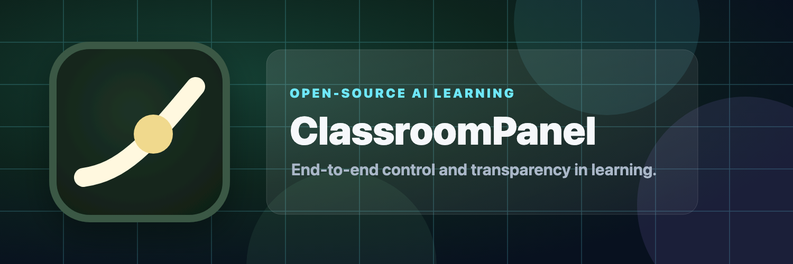

<p align="center">
  
</p>

<p align="center">
  <a href="https://www.classroompanel.com"><b>classroompanel.com</b></a> ·
  <a href="https://www.classroompanel.com/vision">Vision</a> ·
  <a href="docs/VISION.md">Deep-dive vision</a> ·
  <a href="CONTRIBUTING.md">Contributing</a>
</p>

<p align="center">
  <a href="https://github.com/rowant-labs/classroompanel/actions/workflows/ci.yml"></a>
  <a href="LICENSE"></a>
</p>

# ClassroomPanel

**The AI tutor with a living blackboard.** A student asks "I don't understand derivatives" and watches the panel become the lesson: graph, tangent line, explanation, practice problem, and feedback — all on one board. Upload a full textbook and it becomes a multi-unit course with mastery gates and spaced review, tracked in a learner record the family owns.

Built on three commitments:

- **Learning through AI should be open source.** Parents and schools deserve to see exactly what an LLM is teaching their kids — every tutoring rule in this repo is public, auditable code (AGPL-3.0).
- **Bring your own key.** No accounts, no subscription, no middleman: connect an Anthropic, OpenAI, or Google API key and lessons generate live on inference you fund directly. Keys ride each request and are never stored or logged.
- **We save nothing.** The learner record — every prediction, explanation, quiz, and mastered concept — lives in the browser and in files you export. Nothing reaches our servers.

## Try it

- **Hosted:** [classroompanel.com/panel](https://www.classroompanel.com/panel) — bring a key from any provider (the panel links to where to create one).
- **Self-hosted:**

  ```bash
  git clone https://github.com/rowant-labs/classroompanel && cd classroompanel
  npm install
  cp .env.example .env.local   # optional: add server-side keys; BYOK works without them
  npm run dev
  ```

Without any key, `/panel` opens with an empty board and asks for one before drawing — it never passes off a canned lesson as generated. The fixed sample board lives at `/demo`.

## How it works

The app is **schema-first**: models return validated lesson JSON, and the renderer draws known block types (explanation, live graphs, sketches, simulations, free-body diagrams, worked equations, generated pictures, do-blocks, quizzes). No model-produced HTML is ever rendered. Malformed generations are salvaged block-by-block rather than discarded, and a stall watchdog means the board never hangs.

Every lesson is built around **doing**: the student commits to a prediction before the explanation, says the idea back in their own words afterward (the tutor reads and grades the explanation when a key is live), and answers a quick check. Only the quiz moves mastery; the record schedules spaced review of what's fading.

The model router is **provider-agnostic** — each job (tutoring, board drawing, fast grading) goes to the best-suited model among whichever providers have a live key, and self-hosters can pin any role via `CLASSROOMPANEL_*_MODEL` env vars.

Key routes: `/panel` (the learning terminal), `/vision`, `/terms`, `/demo`. Architecture notes live in [docs/](docs/).

## Contributing

Contributions are welcome — see [CONTRIBUTING.md](CONTRIBUTING.md) for the ground rules (schema-first, the pedagogy spec, provider quirks) and the CLA, and [docs/VISION.md](docs/VISION.md) for what this project will and won't build. The most valuable areas right now: mastery-loop improvements, new board block types, curriculum-ingestion robustness, self-hosting experience, and board accessibility.

Bugs and ideas: [open an issue](https://github.com/rowant-labs/classroompanel/issues). Security problems: [report privately](https://github.com/rowant-labs/classroompanel/security/advisories/new) — see [SECURITY.md](SECURITY.md).

## License

[AGPL-3.0](LICENSE). Anyone can use, study, modify, and self-host ClassroomPanel; modifications served to users over a network must be shared under the same license. Every AGPL release is irrevocable — the open product survives any business outcome. The hosted service at classroompanel.com is how the project funds itself; self-hosters never depend on it. "ClassroomPanel" and its logo are project trademarks: forks are welcome and must use their own name.
